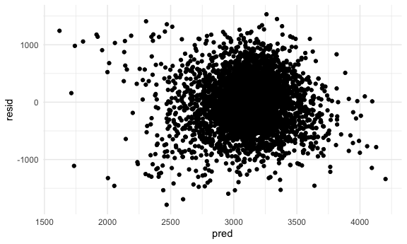
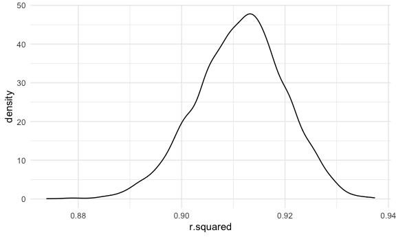
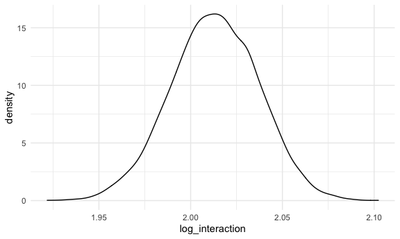

P8105 Homework 6 - Tanya Butt (thb2114)
================

## Problem 1

``` r
birthweight_df = 
  read_csv("birthweight.csv") %>% 
  janitor::clean_names() %>% 
  mutate(
    babysex = as.factor(babysex),
    malform = as.factor(malform),
    frace = as.factor(frace),
    mrace = as.factor(mrace)
  ) %>% 
  select(-c(pnumlbw, pnumsga)) 
## Rows: 4342 Columns: 20
## ── Column specification ────────────────────────────────────────────────────────
## Delimiter: ","
## dbl (20): babysex, bhead, blength, bwt, delwt, fincome, frace, gaweeks, malf...
## 
## ℹ Use `spec()` to retrieve the full column specification for this data.
## ℹ Specify the column types or set `show_col_types = FALSE` to quiet this message.
```

``` r
fit_df = 
  birthweight_df %>% 
  select(gaweeks, momage, delwt, wtgain, bwt)

fit = lm(bwt ~ gaweeks + momage + delwt  + wtgain, data = fit_df) 

fit_df %>% 
  modelr::add_residuals(fit) %>% 
  modelr::add_predictions(fit) %>% 
  ggplot(aes(x = pred, y = resid)) + geom_point()
```



``` r
fit
## 
## Call:
## lm(formula = bwt ~ gaweeks + momage + delwt + wtgain, data = fit_df)
## 
## Coefficients:
## (Intercept)      gaweeks       momage        delwt       wtgain  
##    -184.574       58.530       12.162        4.234        5.803
```

``` r
fit_alt_1 = lm(bwt ~ blength + gaweeks, data = birthweight_df) %>% 
  broom::tidy()

fit_alt_1
```

    ## # A tibble: 3 × 5
    ##   term        estimate std.error statistic  p.value
    ##   <chr>          <dbl>     <dbl>     <dbl>    <dbl>
    ## 1 (Intercept)  -4348.      98.0      -44.4 0       
    ## 2 blength        129.       1.99      64.6 0       
    ## 3 gaweeks         27.0      1.72      15.7 2.36e-54

``` r
fit_alt_2 = lm(bwt ~ bhead + blength + babysex + bhead*blength + bhead*babysex +
            blength*babysex + bhead*blength*babysex, data = birthweight_df) %>% 
  broom::tidy()

fit_alt_2
```

    ## # A tibble: 8 × 5
    ##   term                    estimate std.error statistic      p.value
    ##   <chr>                      <dbl>     <dbl>     <dbl>        <dbl>
    ## 1 (Intercept)            -7177.     1265.       -5.67  0.0000000149
    ## 2 bhead                    182.       38.1       4.78  0.00000184  
    ## 3 blength                  102.       26.2       3.90  0.0000992   
    ## 4 babysex2                6375.     1678.        3.80  0.000147    
    ## 5 bhead:blength             -0.554     0.780    -0.710 0.478       
    ## 6 bhead:babysex2          -198.       51.1      -3.88  0.000105    
    ## 7 blength:babysex2        -124.       35.1      -3.52  0.000429    
    ## 8 bhead:blength:babysex2     3.88      1.06      3.67  0.000245

## Problem 2

Loading the 2017 Central Park weather data:

``` r
weather_df = 
  rnoaa::meteo_pull_monitors(
    c("USW00094728"),
    var = c("PRCP", "TMIN", "TMAX"), 
    date_min = "2017-01-01",
    date_max = "2017-12-31") %>%
  mutate(
    name = recode(id, USW00094728 = "CentralPark_NY"),
    tmin = tmin / 10,
    tmax = tmax / 10) %>%
  select(name, id, everything())
## Registered S3 method overwritten by 'hoardr':
##   method           from
##   print.cache_info httr
## using cached file: ~/Library/Caches/R/noaa_ghcnd/USW00094728.dly
## date created (size, mb): 2021-10-07 18:01:39 (7.604)
## file min/max dates: 1869-01-01 / 2021-10-31

set.seed(1)
```

Creating 5000 bootstrap samples:

``` r
boot_sample = function(df) {
  sample_frac(df, replace = TRUE)
}

boot_straps = 
  tibble(
    strap_number = 1:5000,
    strap_sample = rerun(5000, boot_sample(weather_df))
  )

boot_straps
## # A tibble: 5,000 × 2
##    strap_number strap_sample      
##           <int> <list>            
##  1            1 <tibble [365 × 6]>
##  2            2 <tibble [365 × 6]>
##  3            3 <tibble [365 × 6]>
##  4            4 <tibble [365 × 6]>
##  5            5 <tibble [365 × 6]>
##  6            6 <tibble [365 × 6]>
##  7            7 <tibble [365 × 6]>
##  8            8 <tibble [365 × 6]>
##  9            9 <tibble [365 × 6]>
## 10           10 <tibble [365 × 6]>
## # … with 4,990 more rows
```

Determining the distribution of r-squared hat:

``` r
bootstrap_results_1 = 
  boot_straps %>% 
  mutate(
    models = map(strap_sample, ~lm(tmax ~ tmin, data = .x) ),
    results = map(models, broom::glance)) %>% 
  select(-strap_sample, -models) %>% 
  unnest(results)
  
bootstrap_results_1_graph = ggplot(bootstrap_results_1, aes(x = r.squared)) + 
  geom_density()

bootstrap_results_1_graph
```



The distribution has a bit of a heavy tail extending to the lower
values, suggesting there may be outliers included in the bootstrap
sample.

Below is a table of the 95% CI for r hat squared calculated using the
5000 bootstrap samples:

``` r
bootstrap_results_1 %>% 
  summarize(
    ci_lower = quantile(r.squared, 0.025),
    ci_upper = quantile(r.squared, 0.975)) %>% 
  knitr::kable()
```

| ci\_lower | ci\_upper |
|----------:|----------:|
| 0.8936684 |  0.927106 |

Determining the distribution of log(beta zero hat \* beta one hat):

``` r
bootstrap_results_2 = 
  boot_straps %>% 
  mutate(
    models = map(strap_sample, ~lm(tmax ~ tmin, data = .x) ),
    results = map(models, broom::tidy)) %>% 
  select(-strap_sample, -models) %>% 
  unnest(results) %>%
  select(strap_number, term, estimate) %>% 
  pivot_wider(
    names_from = term,
    values_from = estimate
  ) %>% 
  rename(beta_zero = `(Intercept)`) %>% 
  rename(beta_one = tmin) %>% 
  mutate(log_interaction = log(beta_zero*beta_one))

bootstrap_results_2_graph = ggplot(bootstrap_results_2, aes(x = log_interaction)) + 
  geom_density()
  
bootstrap_results_2_graph
```



The distribution appears closer to normal than the r-squared hat
distribution. There is a bit of a “shoulder” in the upper values, which
may be related to the frequency of outliers in the bootstrap sample.

Below is a table of the 95% CI for the log(beta zero hat \* beta one
hat) calculated using the 5000 bootstrap samples:

``` r
bootstrap_results_2 %>% 
  summarize(
    ci_lower = quantile(log_interaction, 0.025),
    ci_upper = quantile(log_interaction, 0.975)) %>% 
  knitr::kable()
```

| ci\_lower | ci\_upper |
|----------:|----------:|
|  1.964949 |  2.058887 |
