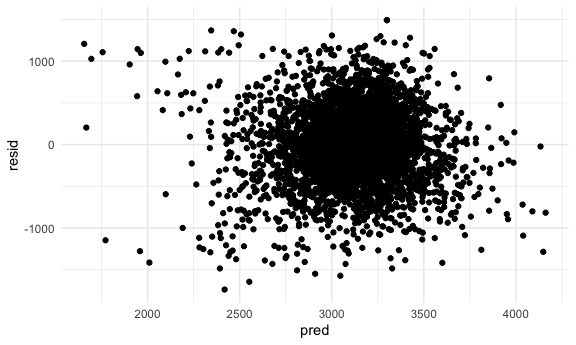
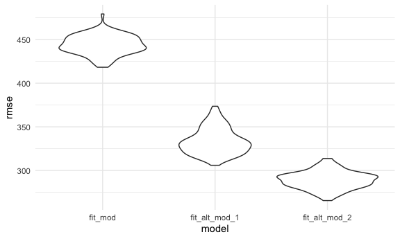
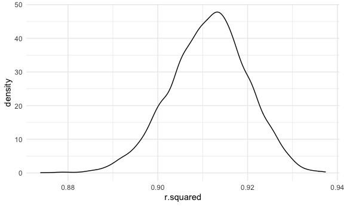
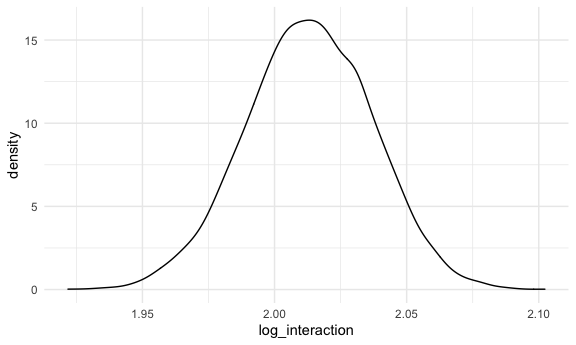

P8105 Homework 6 - Tanya Butt (thb2114)
================

## Problem 1

Loading and cleaning the birthweight dataset:

``` r
birthweight_df = 
  read_csv("birthweight.csv") %>% 
  janitor::clean_names() %>% 
  mutate(
    babysex = as.factor(babysex),
    malform = as.factor(malform),
    frace = as.factor(frace),
    mrace = as.factor(mrace)
  ) %>% 
  select(-c(pnumlbw, pnumsga)) 
## Rows: 4342 Columns: 20
## ── Column specification ────────────────────────────────────────────────────────
## Delimiter: ","
## dbl (20): babysex, bhead, blength, bwt, delwt, fincome, frace, gaweeks, malf...
## 
## ℹ Use `spec()` to retrieve the full column specification for this data.
## ℹ Specify the column types or set `show_col_types = FALSE` to quiet this message.
```

Below I propose a regression model for birthweight, based on a
hypothesized structure of specific factors. The factors included in the
proposed model are based on published references of potential influences
on infant birth weight.

These factors include: the baby’s sex, gestational age in weeks,
mother’s age and weight at delivery, and mother’s weight gain during
pregnancy (lbs).

``` r
fit = lm(bwt ~ babysex + gaweeks + momage + delwt  + wtgain, data = birthweight_df)

fit %>% broom::tidy()
## # A tibble: 6 × 5
##   term        estimate std.error statistic   p.value
##   <chr>          <dbl>     <dbl>     <dbl>     <dbl>
## 1 (Intercept)  -146.      94.8       -1.54 1.23e-  1
## 2 babysex2      -86.0     13.5       -6.37 2.03e- 10
## 3 gaweeks        59.0      2.18      27.1  4.22e-149
## 4 momage         11.7      1.77       6.59 4.82e- 11
## 5 delwt           4.23     0.338     12.5  1.95e- 35
## 6 wtgain          5.65     0.691      8.17 3.89e- 16
```

Below is a plot of the model’s residuals against fitted values:

``` r
birthweight_df %>% 
  add_residuals(fit) %>% 
  add_predictions(fit) %>% 
  ggplot(aes(x = pred, y = resid)) + geom_point()
```



I will now compare my model against two models below:

``` r
cv_df =
  crossv_mc(birthweight_df, 100) %>% 
  mutate(
    train = map(train, as_tibble),
    test = map(test, as_tibble))

cv_df = 
  cv_df %>% 
  mutate(
    fit_mod  = map(train, ~lm(bwt ~ babysex + gaweeks + momage + delwt + wtgain, 
                              data = .x)),
    fit_alt_mod_1 = map(train, ~lm(bwt ~ blength + gaweeks, data = .x)),
    fit_alt_mod_2 = map(train, ~lm(bwt ~ bhead + blength + babysex + 
                              bhead*blength + bhead*babysex + blength*babysex +
                              bhead*blength*babysex, data = .x))) %>% 
  mutate(
    rmse_fit_mod = map2_dbl(fit_mod, test, ~rmse(model = .x, data = .y)),
    rmse_fit_alt_mod_1 = map2_dbl(fit_alt_mod_1, test, ~rmse(model = .x, data = .y)),
    rmse_fit_alt_mod_2 = map2_dbl(fit_alt_mod_2, test, ~rmse(model = .x, data = .y)))

cv_df %>% 
  select(starts_with("rmse")) %>% 
  pivot_longer(
    everything(),
    names_to = "model", 
    values_to = "rmse",
    names_prefix = "rmse_") %>% 
  mutate(model = fct_inorder(model)) %>% 
  ggplot(aes(x = model, y = rmse)) + geom_violin()
```



It appears as though alternative model 2, which includes head
circumference, length, sex, and all interactions between these
variables, had the best predictive accuracy. Whether this model is the
best to use remains to be determined, as model fitting requires
balancing complexity with goodness of fit and interpretability.

## Problem 2

Loading the 2017 Central Park weather data:

``` r
weather_df = 
  rnoaa::meteo_pull_monitors(
    c("USW00094728"),
    var = c("PRCP", "TMIN", "TMAX"), 
    date_min = "2017-01-01",
    date_max = "2017-12-31") %>%
  mutate(
    name = recode(id, USW00094728 = "CentralPark_NY"),
    tmin = tmin / 10,
    tmax = tmax / 10) %>%
  select(name, id, everything())
## Registered S3 method overwritten by 'hoardr':
##   method           from
##   print.cache_info httr
## using cached file: ~/Library/Caches/R/noaa_ghcnd/USW00094728.dly
## date created (size, mb): 2021-10-07 18:01:39 (7.604)
## file min/max dates: 1869-01-01 / 2021-10-31

set.seed(1)
```

Creating 5000 bootstrap samples:

``` r
boot_sample = function(df) {
  sample_frac(df, replace = TRUE)
}

boot_straps = 
  tibble(
    strap_number = 1:5000,
    strap_sample = rerun(5000, boot_sample(weather_df))
  )

boot_straps
## # A tibble: 5,000 × 2
##    strap_number strap_sample      
##           <int> <list>            
##  1            1 <tibble [365 × 6]>
##  2            2 <tibble [365 × 6]>
##  3            3 <tibble [365 × 6]>
##  4            4 <tibble [365 × 6]>
##  5            5 <tibble [365 × 6]>
##  6            6 <tibble [365 × 6]>
##  7            7 <tibble [365 × 6]>
##  8            8 <tibble [365 × 6]>
##  9            9 <tibble [365 × 6]>
## 10           10 <tibble [365 × 6]>
## # … with 4,990 more rows
```

Determining the distribution of r-squared hat:

``` r
bootstrap_results_1 = 
  boot_straps %>% 
  mutate(
    models = map(strap_sample, ~lm(tmax ~ tmin, data = .x) ),
    results = map(models, broom::glance)) %>% 
  select(-strap_sample, -models) %>% 
  unnest(results)
  
bootstrap_results_1_graph = ggplot(bootstrap_results_1, aes(x = r.squared)) + 
  geom_density()

bootstrap_results_1_graph
```



The distribution has a bit of a heavy tail extending to the lower
values, suggesting there may be outliers included in the bootstrap
sample.

Below is a table of the 95% CI for r hat squared calculated using the
5000 bootstrap samples:

``` r
bootstrap_results_1 %>% 
  summarize(
    ci_lower = quantile(r.squared, 0.025),
    ci_upper = quantile(r.squared, 0.975)) %>% 
  knitr::kable()
```

| ci\_lower | ci\_upper |
|----------:|----------:|
| 0.8936684 |  0.927106 |

Determining the distribution of log(beta zero hat \* beta one hat):

``` r
bootstrap_results_2 = 
  boot_straps %>% 
  mutate(
    models = map(strap_sample, ~lm(tmax ~ tmin, data = .x) ),
    results = map(models, broom::tidy)) %>% 
  select(-strap_sample, -models) %>% 
  unnest(results) %>%
  select(strap_number, term, estimate) %>% 
  pivot_wider(
    names_from = term,
    values_from = estimate
  ) %>% 
  rename(beta_zero = `(Intercept)`) %>% 
  rename(beta_one = tmin) %>% 
  mutate(log_interaction = log(beta_zero*beta_one))

bootstrap_results_2_graph = ggplot(bootstrap_results_2, aes(x = log_interaction)) + 
  geom_density()
  
bootstrap_results_2_graph
```



The distribution appears closer to normal than the r-squared hat
distribution. There is a bit of a “shoulder” in the upper values, which
may be related to the frequency of outliers in the bootstrap sample.

Below is a table of the 95% CI for the log(beta zero hat \* beta one
hat) calculated using the 5000 bootstrap samples:

``` r
bootstrap_results_2 %>% 
  summarize(
    ci_lower = quantile(log_interaction, 0.025),
    ci_upper = quantile(log_interaction, 0.975)) %>% 
  knitr::kable()
```

| ci\_lower | ci\_upper |
|----------:|----------:|
|  1.964949 |  2.058887 |
